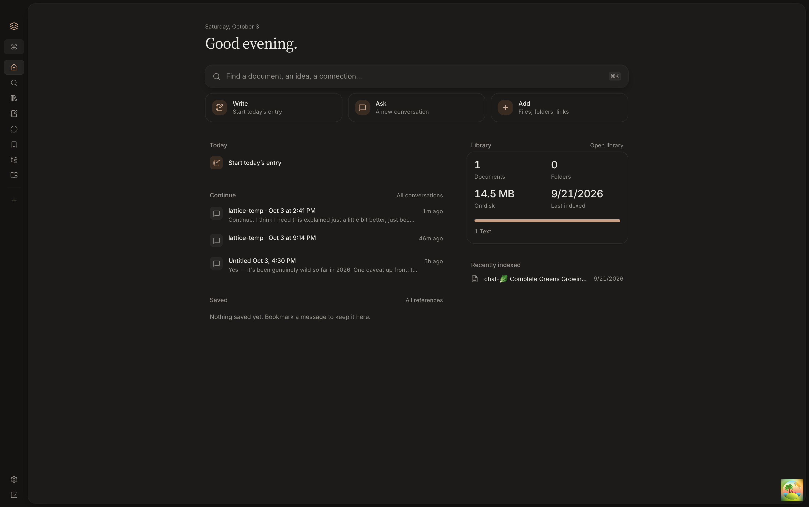
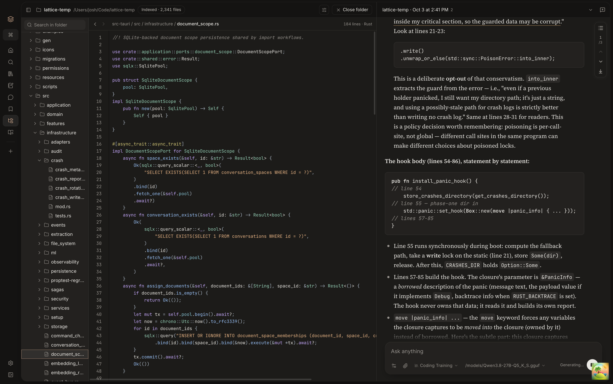
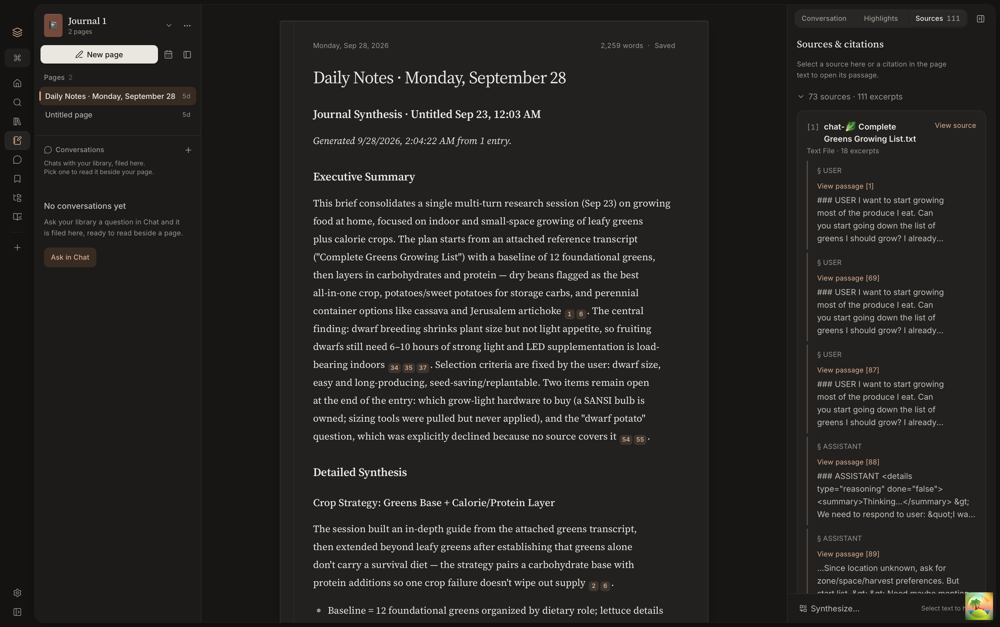
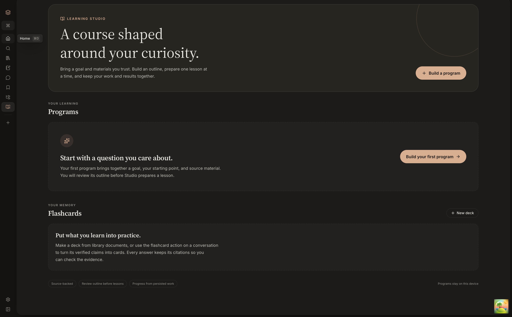

# Lattice

Lattice is a local-first desktop knowledge base. It indexes the files on your
machine, searches them by keyword and by meaning, and answers questions with
local language models — every answer cites the documents it came from.

Nothing you index leaves your computer. There is no account, no cloud, and no
telemetry.

## Screenshots

Screenshots from the running macOS app. Click an image to view it at full size.

| Home dashboard | Explorer and chat |
| --- | --- |
| [](docs/screenshots/dashboard.png) | [](docs/screenshots/explorer.png) |
| **Journal and sources** | **Learning Studio** |
| [](docs/screenshots/journal.png) | [](docs/screenshots/studio.png) |

## What it does

- **Search that understands meaning.** Indexing runs locally: text is
  extracted, embedded on-device, and stored in SQLite. Search blends exact
  keyword matching with vector similarity, so "that memo about the offsite"
  finds the document even if the word "offsite" never appears in your query.
- **Chat with receipts.** Ask questions against your library and get answers
  with footnoted citations you can click through to the source. A retrieval
  trace shows which documents were pulled in and why.
- **A home page that tells the truth.** The dashboard reports what's actually
  in your library — document counts, storage used, recent files, and the
  conversations worth picking back up. If a number can't be computed, the
  tile is left out rather than showing a zero.
- **Learning Studio.** Build a learning program from your sources: a
  curriculum, practice, hands-on labs that run in a sandbox, assessments, and
  recall. Flashcard decks live here too: turn a document or a conversation
  into a deck, review with spaced repetition, and every card keeps its
  citations so you can check the evidence behind it.
- **Explorer.** Open a folder from disk beside a chat. Browse the tree, read
  files in a code viewer, and ask questions the model answers by reading that
  folder, pointing at the exact lines. Each folder gets its own search index,
  kept apart from your library.
- **Documents that know their neighbors.** Open any document and the related
  panel shows what links to it, what's similar, and which conversations cite
  it.
- **A journal and a reference inbox** for the notes and passages you want to
  keep coming back to, plus quick capture from anywhere.

The first launch offers a model bundle recommended for your hardware: an
embedding model (Qwen3-Embedding where there is a GPU backend, MiniLM
otherwise) and a local chat model. Downloads continue in the background, the
full catalog stays in Settings, and after that it works fully offline.
Optional chat providers (Ollama, a remote llama.cpp server, OpenAI,
Anthropic) are available if you want them; `api-rust/` holds an experimental
sync service the app does not use yet.

## Getting started

The desktop release targets are Windows 11 x64, macOS 13.3+ (Apple Silicon and
Intel), and Ubuntu 24.04 LTS x64. Intel Mac support is being qualified and uses
CPU inference. See [platform support](docs/development/platform-support.md)
for its build instructions and remaining release gates.

Native compatibility tests build and exercise isolated app packages on macOS
(both architectures), Windows x64 and Ubuntu. See the
[desktop test guide](e2e/desktop/README.md) for local commands and CI coverage.

You'll need Node.js 20.19+ or 22.12+ (CI uses 24), a current Rust toolchain,
and the [Tauri prerequisites](https://v2.tauri.app/start/prerequisites/) for
your platform. Local generation uses a bundled `llama-server` sidecar; see
[src-tauri/binaries](src-tauri/binaries/README.md) for how it is fetched.

```bash
npm ci
npm run tauri:dev
```

The frontend can run on its own with `npx vite` (port 5173), but anything that
talks to the Rust backend needs the Tauri dev process.

## Repository layout

```text
.
├── src/           # React and TypeScript frontend
├── src-tauri/     # Rust backend and Tauri configuration
├── api-rust/      # Experimental Rust sync service
├── e2e/           # Playwright renderer journeys and native desktop tests
├── evals/         # Retrieval and conversation-memory evaluation sets and results
├── docs/          # Architecture notes, design docs, and user docs
└── scripts/       # Repository checks and developer utilities
```

## Development checks

Frontend:

```bash
npm run type-check
npm run lint
npm test -- --run
npx vite build && node scripts/check-initial-js-budget.mjs dist
```

Production renderer smoke tests (Chromium and WebKit, with simulated desktop IPC):

```bash
npx playwright install --with-deps chromium webkit
npm run test:e2e
```

The suite builds its own renderer in `e2e-results/renderer` and serves it on port
4173. Keep that port free; the tests do not reuse a running development server.

Desktop backend:

```bash
cargo fmt --manifest-path src-tauri/Cargo.toml --all -- --check
cargo clippy --manifest-path src-tauri/Cargo.toml --all-targets
cargo test --manifest-path src-tauri/Cargo.toml --lib
```

Architecture and contract checks:

```bash
bash scripts/check-repository-barrier.sh
bash scripts/check-rust-layer-boundaries.sh
python3 scripts/check-sql-contracts.py
python3 scripts/check-tauri-command-inventory.py
```

See [CONTRIBUTING.md](CONTRIBUTING.md) for project conventions and the full
change checklist.

## License

Lattice is available under the [MIT License](LICENSE).
