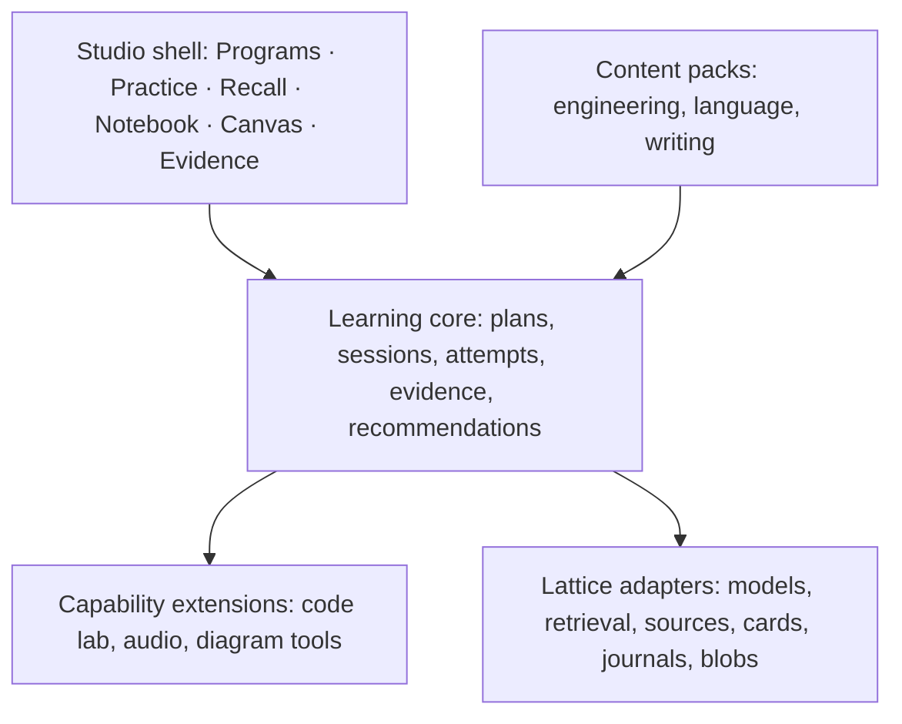

# Lattice Studio — a complete learning workspace

Status: implemented candidate architecture. Sections 13–17 record the production
contracts; Sections 3–12 describe the product and its release gates. Deterministic
candidate evidence and the remaining opt-in/manual release checks are recorded in
`docs/development/learning-studio-verification.md`. Research and repository
inspection: 2026-09-30 through 2026-10-01. Any test fixtures or interface previews
use illustrative content, not real learner records.

## 1. Decision and purpose

Build **Studio**, an enclosed learning module inside Lattice. **Acclimate** is
its first complete program: a return to software engineering through C#/.NET,
Python, and AI-service practice. Studio itself is subject-independent. A person
learning a language, preparing a presentation, studying history, or developing a
design practice should never need to encounter programming terminology.

The product promise is: **turn material you care about into abilities you can
demonstrate, remember, and use in a new situation.**

Studio owns the whole learning experience: choosing a goal, building a program,
taking lessons, attempting work, receiving feedback, recording notes, sketching,
reviewing cards, and returning later to test what remains. A session should not
send the learner through Lattice's general Chat, Journal, and Study routes to
finish one task. Those existing capabilities become embedded services and
reusable components behind a consistent Studio shell.

“Enclosed” means a coherent interface, an explicit domain boundary, independent
session lifecycle, and owned progress data. It does not require a second model
manager, vector database, notebook store, or desktop process. Use a modular
monolith with explicit host adapters. Do not fork Lattice or start with a dynamic
plugin marketplace.

The distinctive proposal is a connected cycle:

**Source → attempt → feedback → explanation → recall → delayed transfer.**

Every step keeps its provenance. A mistake can become a practice prompt; a
practice explanation can become a note; a note can become an editable card; a
later attempt can show whether the idea transfers. This combination is a product
hypothesis to validate, not a claim of scientific novelty or proven efficacy.

## 2. Research translated into decisions

| Evidence or precedent | Design implication | Limit |
| --- | --- | --- |
| IES recommends spaced study, alternating worked examples with problems, retrieval quizzes, and deep explanatory questions [R1]. | Lessons alternate explanation and attempts; reviews recur; learners explain their reasoning. | Evidence strength differs by recommendation. This does not validate our particular scheduler, interface, or adult-engineering curriculum. |
| Shen and Tamkin's randomized coding study measured weaker immediate understanding with AI assistance; interaction patterns varied [R2]. | Separate assisted completion from independent demonstration. Include reading, diagnosis, implementation, and explanation. | Small sample, mostly junior engineers learning an unfamiliar Python library. Immediate assessment is not a longitudinal study of experienced engineers losing skills. Interaction subgroups are descriptive, not causal. |
| Exercism distinguishes guided learning and open practice, with mentoring available in both [R3]. | Recommend a pathway while allowing experienced learners to challenge prerequisites and practice freely. | Product precedent, not evidence that a particular unlock policy improves learning. |
| CodeCrafters uses staged projects that reconstruct real systems [R4]. | The engineering pack should build a coherent service and introduce realistic changes and faults. | We will author original exercises; this is not a plan to copy a catalog. |
| FSRS has a Rust scheduler and optimizer [R5]. | Evaluate a maintained scheduler for recall instead of inventing another interval formula. | Recall scheduling does not estimate job readiness, creative judgment, or practical competence. |
| CEFR distinguishes multiple kinds of language activity and uses capability descriptors [R6]. | A language pack needs separate evidence for comprehension, production, and interaction. | AI feedback is not an official language certification or calibrated proficiency score. |

Research-grounded features and experimental features must be distinguishable.
The former include recall, delayed practice, worked examples, and explanation.
The latter include automated misconception extraction, generated transfer
exercises, adaptive sequencing, and AI rubric feedback. Evaluate the latter
before allowing them to drive strong progress claims.

## 3. The complete product

### 3.1 Studio shell

Enter through one top-level **Studio** destination. Inside it, navigation is
consistent across subjects:

| Destination | Purpose |
| --- | --- |
| Today | Resume work, see due recall, and choose a session fitting available time. Each recommendation explains why it appears. |
| Programs | Goals, a lesson sequence, prerequisites, projects, and an editable plan. Multiple programs can coexist. |
| Practice | The active workbench, exercises, labs, challenges, and simulations. |
| Recall | Editable decks, due cards, quiz practice, and short reconstruction tasks. |
| Notebook | Program notebooks, scratch notes, reflections, excerpts, and personal explanations. |
| Canvas | Freehand sketches, diagrams, concept maps, annotations, and visual recall. |
| Evidence | Attempts and artifacts showing what the learner has done, under what conditions, and when. |
| Sources | Program-scoped library, official references, source versions, and refresh status. |

The header contains the current program, a direct return to Lattice, and model
status. Setup belongs in a compact Studio settings surface using the host's
existing model configuration. All subject-specific controls live within the
activity, not in the global navigation.

Use Lattice's warm surfaces, restrained copper accent, serif editorial headings,
and existing font stack. The visual hierarchy puts the learner's work first.
Program pages can be spacious; the workbench is focused and compact. Avoid
constant chat bubbles, completion confetti, shame-inducing streaks, and fictional
“87% ready” dashboards. Support dark mode, keyboard navigation, reduced motion,
resizable desktop panes, and a single-pane focus layout. A canvas must have a
text-outline alternative; microphone and drawing are never mandatory.

### 3.2 Onboarding and program builder

Ask for a concrete goal, prior experience, available time, preferred materials,
and assistance preferences. Accept an imported syllabus, selected documents,
documentation URLs, personal notes, or a natural-language goal. Job descriptions
are an optional input to the engineering pack, not a universal onboarding field.

Offer a short diagnostic that can be skipped. It proposes placement and identifies
uncertainty; it must not pretend a few questions comprehensively measure ability.

Generate an editable **program proposal** containing outcomes, prerequisites,
session estimates, a project or application context, evidence requirements, and
source coverage. Show the whole outline, but fully prepare only the next few
sessions. Preparation of later sessions uses results from completed ones, while
preserving the user's accepted goals. Changes are visible diffs with reasons;
completed lesson versions never change underneath their attempts.

Keep curated starter programs available without a model. Generated programs
remain marked as drafts until accepted. A source gap is visible in the proposal,
not covered with an invented citation. The user can shorten, reorder, replace,
or skip material without losing earlier records.

### 3.2.1 Program is a complete course experience

The hierarchy is **Program → Module → Lesson → Activity**, with separate
assessment objects. Program is the primary learning destination, not a list of
links to chat sessions. Each module has a purpose, outcomes, prerequisites,
lessons, practice, a checkpoint quiz, a module test, and a transfer task. A
program concludes with a cumulative application and a later retention check.
These structures are generic; programming is one content pack.

The overview contains four intentionally different regions:

1. A resume panel naming the current module, lesson, saved position, and next
   concrete action. Show actual persisted progress, not fixture percentages.
2. A module journey with completed/current/upcoming states. Selecting a module
   reveals its full syllabus without moving the learner's resume position.
3. A module workspace with Lessons, Practice, Quizzes, and Test views. Show
   preparation state, estimated effort, attempt history, and sources in context.
4. An outcomes panel distinguishing encountered, practiced, demonstrated, and
   due-for-recheck evidence. Never infer mastery from opened pages or time spent.

On narrower windows the journey becomes a wrapping selector and the outcome
panel moves below the workspace. Keep the resume action visible, use semantic
headings and real buttons, preserve keyboard focus after navigation, and provide
text alongside every status color. Do not bury the current module in a large
accordion or force scrolling through completed modules to resume.

### 3.2.2 Lesson anatomy and depth

A prepared lesson includes a concrete objective, prerequisites, source-backed
teaching, a worked example with reasoning, a guided exercise, independent
practice, a brief retrieval check, and reflection. The sequence may vary with
the learner's experience. Explain common mistakes and why plausible alternatives
fail. Coding lessons include reading unfamiliar code and tracing behavior, not
only filling blanks; writing and language lessons use equally native activities.

Render structured blocks with their own purpose and source references. Long
lessons have a local contents rail and durable checkpoints. Notes, sketches,
questions to the tutor, and card drafts attach to the exact lesson revision.
Opening an explanation is not completion. A learner explicitly marks a lesson
complete; required submissions and assessment results are shown separately.
A skip or prerequisite challenge is recorded as such, never silently completed.

### 3.2.3 Practice, quizzes, tests, and projects are different

| Surface | Learner experience | Feedback and evidence |
| --- | --- | --- |
| Practice questions | Target a concept; repeat with a changed example; hints and reference access available | Immediate explanation after submission, why alternatives fail, source links, retry history; assisted practice |
| Checkpoint quiz | Short mixed retrieval after a lesson or group; configurable question formats | Feedback after the selected batch; misconception grouping and suggested lessons; a quiz score, not mastery |
| Module test | Explicit coverage, conditions, expected time, unanswered review, and final submission | Withhold answer keys until submission; preserve immutable form and answers; criterion-specific result and retake |
| Cumulative assessment | Mix earlier modules and dependencies | Separate recent recall from retained performance; show coverage gaps |
| Applied project | Create a meaningful artifact with several constraints | Rubric, deterministic checks where available, explanation of decisions, revisions, and uncertainty |
| Transfer / delayed check | Change the context and revisit after a delay | New evidence linked to the original outcome without overwriting earlier attempts |

Assessment blueprints define outcome coverage, item formats, difficulty intent,
allowed aids, pass criteria, and feedback timing. The generated question bank
stores versioned prompts, source evidence, answer rationale, misconceptions,
and exposure history. Do not reuse a just-revealed practice item as supposedly
unseen test evidence. Multiple-choice, short answer, explanation, ordering,
artifact tasks, and oral response are extensible formats; early releases must
label the formats they actually support.

Before submission, tests show answered/unanswered counts and allow navigation.
Submission is idempotent and transactional. A lost response can be retried using
the same attempt ID. Results preserve question order, selected answers,
conditions, grader identity, scoring rules, and source versions. An interrupted
or unavailable assessment is not a failing grade. Tests can be retaken without
erasing history. New forms must cover the same blueprint; until validated parallel
forms exist, repeats must be identified as previously exposed items.

### 3.2.4 Progress, adaptation, and curriculum authorship

Content completion, assessment performance, and outcome evidence are separate
projections. The course completion fraction uses the accepted revision's required
lessons; changing its denominator is shown as a plan change. The resume cursor
is the last actively worked location, with a deterministic next incomplete
lesson as fallback. An upcoming module can be previewed without changing either.
No readiness percentage, calibration claim, or adaptive decision is inferred
from model confidence.

The curriculum is generated from the learner's goal, experience, available time,
diagnostic evidence, and acquired sources. The schema and quality checks are
application code; the particular syllabus and teaching material are not.
Curated programs are optional authored content and clearly labeled. An outline
is accepted before lessons are prepared. Upcoming lessons display **Outline**,
**Preparing**, **Ready**, or a recoverable preparation failure. Preparation is
bounded per lesson. Attempts freeze the lesson and assessment versions they used.

Adaptation proposes explicit changes: add prerequisite work, replace a practice
variant, add a delayed check, or alter upcoming pacing. Explain the observation
behind each proposal and let the learner keep the accepted plan. Completed work
and already-started tests never change underneath the learner.

### 3.3 Lesson and practice workbench

The common workbench has a brief, the current activity, an optional tutor rail,
and a source/notebook/canvas drawer. A lesson is a sequence of typed blocks:
explanation, worked example, reading, prediction, recall, artifact creation,
comparison, critique, conversation, reflection, and delayed follow-up.

The lesson author chooses the sequence. A novice may need a worked example
before an attempt; an experienced learner may start with a diagnostic challenge.
Do not force every person into “struggle first” or make hints inaccessible.

Activity tools include text, structured answers, choices, a canvas, attachments,
and optional extension tools such as a code editor or audio capture. An exercise
can use several artifacts: code plus an explanation, a diagram plus a decision,
or a recording plus its transcript.

Each attempt saves a version of the prompt, artifact, applicable source set,
rubric, conditions, and assistance received. A user can revisit an old attempt,
compare revisions, and start a new attempt without overwriting the original.

### 3.4 Tutor modes and assistance

Three session modes communicate the learning contract:

- **Explore:** explanations and worked examples are freely available.
- **Practice:** attempt, question, graduated hints, critique, and optional solution.
- **Demonstrate:** selected aids are unavailable for this attempt; feedback follows submission.

A learner can switch modes. Switching or revealing a solution updates the
attempt's recorded conditions. The app does not police the clipboard, inspect
other apps, or claim it can detect external assistance.

The hint ladder is explicit: orienting question → relevant concept/source →
partial strategy → worked explanation. Asking to reveal a solution remains
possible; the record says it was revealed. It does not erase the learner's work.

The tutor can quote sources, ask for a prediction, review a selected artifact,
point to a contradiction, or propose a follow-up. It cannot silently replace the
learner's artifact or mark its own response as proof of mastery. Critique should
identify an observable issue and ask the learner to act, with a direct explanation
available when needed.

### 3.5 Recall studio

Support manual creation and editable drafts generated from lessons, selected
passages, notes, tutor discussions, and observed mistakes. Give each proposed
card an origin and its supporting evidence, or explicitly mark it as a personal
mnemonic or unverified draft. Accept, edit, merge, or discard each draft.

Card types: question/answer, cloze, reverse-direction prompts, image occlusion,
code prediction, and small reconstruction prompts. Store these as typed variants,
not one multiple-choice record with hidden fields. Quiz questions and recall
cards may share a concept while retaining different assessment semantics.

Customization includes wording, examples, tags, decks, suspension, daily limits,
and schedule settings. Show source references after a recall response to avoid
giving away the answer. Detect near-duplicate drafts as suggestions, never
silently merge cards or erase review history. Material answer changes create a
new card version and offer a scheduling reset.

Use a versioned scheduling adapter. Start with preserved existing schedules,
then evaluate FSRS migration with replayable review history and conservative
defaults. Do not train personal parameters from insufficient history or promise
a retention percentage is a measured result. Long practical exercises use a
separate follow-up policy; a twenty-minute lab is not a flashcard.

### 3.6 Notebook and canvas

Provide multiple named notebooks with nested pages, lesson-linked notes,
scratchpads, rich text, code blocks, source excerpts, backlinks, and Markdown
export. Reuse the existing editor and journal persistence through a service
boundary. Learner-authored text stays distinguishable from model suggestions.

The canvas includes freehand drawing, shapes, connectors, text, images, and
source/note links. Save editable scene data and asset references, not only a PNG.
Provide undo, autosave, snapshots, image/SVG export, and textual descriptions.
An embedded Excalidraw editor is the preferred candidate [R8], subject to the
desktop compatibility spike. Disable external collaboration and hosted save
flows unless they become an explicitly selected capability.

“Reconstruct from memory” starts with a blank copy of a diagram and later reveals
the reference. Drawing quality is never confused with conceptual accuracy.
AI interpretation is a suggestion, with a text-only alternative when the chosen
model cannot process images.

### 3.7 Evidence and adaptive follow-up

For each outcome, show a timeline and separate dimensions: recall, explanation,
application, and transfer, plus subject-specific dimensions. Display concrete
states such as “attempted with hints,” “demonstrated on one task,” and “rechecked
after a delay,” with dates and artifact links. Unknown means unknown.

Define three particularly valuable workflows:

1. **A mistake becomes a new opportunity.** The tutor proposes a misconception,
   links it to the precise attempt, and offers a card and a differently framed
   follow-up. The learner can reject the interpretation.
2. **A changed situation tests transfer.** After success, present a related task
   with changed constraints. In engineering, cancellation becomes cancellation
   during a retry; in a language, a rehearsed request becomes an unexpected
   clarification. Keep distinct variants so answer memorization is visible.
3. **An earlier decision can be revisited.** Open the old artifact, prediction,
   and explanation. Ask what the learner would change now. A new revision shows
   development without rewriting the historical record.

Recommendation policy starts transparent and deterministic: select an eligible
activity that addresses a due review, insufficient evidence, an accepted
misconception, or a learner priority within the time budget. Explain the reason.
Enforce prerequisite and availability constraints first; use a model only to
propose activities inside those constraints. Log the policy version and reasons.
Do not initialize a black-box mastery probability or a full knowledge-tracing
model before there is calibration data.

### 3.8 Simulations, interviews, and portable work

The generic simulation tool supports roles, turns, a scenario, and a rubric.
Engineering supplies incident diagnosis, code review, system design, and mock
interviews. Language learning supplies conversation and comprehension. Writing
can supply an editorial brief and revision review.

For Acclimate, include technical explanations, project walkthroughs, behavioral
story preparation, and optional timed practice. Feedback links to observed
responses. Export selected artifacts and a factual practice record; do not issue
a hiring-readiness guarantee.

Share program packs, original exercises, card decks, and selected evidence
bundles. Import produces a preview with conflicts and missing dependencies.
Default exports omit private chat history, credentials, unrelated notes, and
source bodies whose redistribution has not been authorized. Source URLs and
permitted excerpts can travel with independently authored exercises.

## 4. Three layers that make subject independence real



**Learning core:** subject-neutral goals, programs, outcomes, activity instances,
attempts, artifacts, feedback, recall links, and recommendations. The core has
no `ProgrammingLanguage`, compiler, SDK, or repository dependency.

**Content pack:** data describing a subject's outcomes, terminology, source
policy, activities, misconceptions, reference artifacts, rubrics, and templates.
Packs can reuse other packs by exact dependency version. A program is a learner's
versioned plan assembled from packs and personal materials; it is not itself a
plugin. Prevent prerequisite cycles and unresolved capability requirements.

**Capability extension:** trusted application code implementing an activity tool
or evaluator. Initially these ship with the app behind a registry. Packs cannot
install arbitrary JavaScript, Rust libraries, shell scripts, or model tools.
An absent capability shows a precise limitation and an optional alternative,
such as written practice instead of recording. It must not record the alternative
as evidence of the unavailable skill.

### Architecture check across subjects

| Contract | Engineering | Language | Writing |
| --- | --- | --- | --- |
| Outcome | Propagate cancellation through a worker | Handle a clarification in a conversation | Support an argument with relevant evidence |
| Activity | Diagnose and fix a failing worker | Respond to an unfamiliar follow-up | Revise a weak paragraph |
| Artifact | Files + explanation + diagram | Audio or written reply | Document + revision rationale |
| Observation | Test outcomes and rubric feedback | Comprehensibility and task completion feedback | Rubric feedback and source matching |
| Recall | Predict a control-flow result | Recall a phrase in context | Recall a revision principle |
| Transfer | New failure timing | New partner or constraint | New audience or counterargument |
| Optional capability | Code lab | Audio capture/playback | Revision comparison |

Before stabilizing the core schema, implement a small non-code fixture using
text, notes, and recall. Verify it contains no code fields, can run without a
compiler, and can be completed inside Studio. This is a contract test, not a
commitment to launch several full curricula at once.

## 5. Lattice integration and verified constraints

The following observations come from source inspection, not a live audit.

| Existing area | Evidence in this repository | Required integration |
| --- | --- | --- |
| Chat | `features/conversation/chat.rs`, cancellation, retrieval, tool loop, persistence, turn record | Introduce a headless tutor-turn facade with explicit context and tool policy. Do not call a Tauri command from another use case or copy the chat orchestration. |
| Source archives | `chat/source_snapshots.rs` stores per-conversation page archives; first text for a URL wins | Introduce reusable versioned source snapshots. Preserve historical evidence while supporting explicit freshness checks. |
| Search | `features/search/engine/vector_search/` uses USearch HNSW; SQLite owns metadata | Reuse embedding/search infrastructure with enforced program scope and content-purpose filters. No second vector engine. |
| Study | `features/study/{dto,repository,service,generation,schedule}.rs` and `components/Study/` | Keep one canonical deck/card/review store; expose embedded card services and extend typed card formats. |
| Card generation | Document generation expects five options and source excerpts; conversation generation uses verified claims | Separate recall-card generation from quiz generation. Add generic provenance, drafts, and manual-card support without inventing document IDs. |
| Review schedule | `schedule.rs` is a simple expanding schedule | Add scheduler versioning and replayable migration. Existing behavior is not FSRS. |
| Journal | `components/Journal/`, conversation workspace repositories | Embed reusable editor/note services; Studio owns membership links, not duplicate note content. |
| Blob storage | Content-addressed library and backup lifecycle described in `RUST_ARCHITECTURE.md` | Register artifact ownership and reference counts. Backups include required scenes, source snapshots, and attempts. |
| Renderer state | React Query/backend ownership required by `CONTRIBUTING.md` | Persist through Rust; use local UI state for panes and active tools only. No second localStorage database. |

Some dated design documents describe proposed or superseded behavior. Verify the
current implementation before extracting a service. In particular, the present
chat entry point depends on a container and Tauri events: a clean shared tutor
API is **work to do**, not an already available abstraction.

Preferred module shape:

```text
src/components/LearningStudio/
  shell/ programs/ session/ recall/ notebook/ canvas/ evidence/ sources/
  capabilities/                 # UI adapters registered by capability ID
  hooks/                        # queries/mutations through typed services
src/lib/services/learning.ts     # proposed transport service
src-tauri/src/domain/learning/   # pure, shared learning values and rules
src-tauri/src/application/ports/learning/  # persistence and host-facing contracts
src-tauri/src/features/learning/
  dto.rs plugin.rs di.rs
  programs/ sessions/ tutor/ evidence/ recommendations/ packs/
  repository/ adapters/ capabilities/
src-tauri/migrations/<new additive migration>.sql
```

Follow existing dependency-direction checks. Domain rules import no SQL, Tauri,
filesystem, or model providers. Orchestration depends on ports; adapters can
delegate to host services. No direct cross-feature table writes. Export Rust DTOs
through the binding generator rather than maintaining parallel TS interfaces.
Add `/studio/*` as a lazy route with its own shell and error boundary.

## 6. Domain contracts and storage

### 6.1 Core entities

| Entity | Owns |
| --- | --- |
| LearningSpace | Subject-neutral workspace settings and explicit material scope |
| ProgramRevision | Goal, ordered/conditional activity plan, source set, pack versions |
| ModuleRevision | Ordered lessons, purpose, prerequisites, outcomes, assessment blueprint |
| LessonRevision | Preparation status, typed teaching blocks, sources, objective and estimate |
| AssessmentBlueprint | Coverage, formats, conditions, feedback timing and scoring policy |
| QuestionVersion | Prompt, choices/artifact requirements, answer rationale, sources and exposure |
| AssessmentAttempt | Immutable form, responses, submission ID, conditions and item results |
| ResumeCursor | Last actively worked lesson/block; independent of module browsing |
| Outcome | Capability description, prerequisites, evidence expectations |
| ActivityVersion | Brief, typed blocks, required capabilities, rubric and variant lineage |
| Session | Current activity, mode, durable lifecycle, resume cursor |
| Attempt | Submitted artifact revision, allowed aids, assistance events, conditions |
| ArtifactRevision | Text/scene/file/audio payload references, origin and digest |
| Observation | Evaluator output, scope, authority, uncertainty, rubric version |
| EvidenceLink | Connects outcome, attempt, observation, and source versions |
| FollowUp | Due practice with reason, estimated effort and optional variant |
| SourceSetRevision | Exact source versions available to an activity or tutor turn |
| CapabilityManifest | Supported activities, schemas, evaluator and runtime requirements |

Use a single generic artifact reference with typed payloads. Do not store entire
programs or attempts inside opaque model-authored JSON. Structured extension
payloads may use JSON only with an explicit schema ID/version and validation.

An observation states whether it is a deterministic check, self-report, model
judgment, or human review. It also states its narrow claim: “these six tests
passed” is distinct from “understands cancellation.” A generated rubric cannot
retroactively redefine the conditions under which an old attempt was assessed.

### 6.2 Ownership, revisions, and deletion

Add `learning_*` tables for owned entities and link tables for existing notes,
decks, conversations, and sources. Study continues owning cards and review events;
journal services continue owning note content. One card linked to two programs
has one review history. Deliberately cloning a card creates a new identity.

Every mutation includes an operation ID and expected revision where conflicts
are possible. Persist an attempt, its observations, and the local projection
updates atomically. Background cross-feature work uses a transactional outbox
and idempotent receiving services. Avoid pretending several independent feature
writes form one transaction. A card-generation failure cannot undo a saved
attempt; it leaves a visible retryable job.

Content payloads use managed blobs plus metadata. Existing retention rules are
extended to every new reference type; the garbage collector may delete a blob
only after all live owners release it. Removing a program detaches shared notes
and decks. Deleting an owned source invalidates dependent evidence and offers an
explicit choice about retained archives; historical references become missing
or tombstoned instead of silently resolving to a different page.

Private material stays scoped by default. An “add to library” action makes
material discoverable beyond the learning space. Backups retain canonical data;
embeddings and recommendations can be rebuilt. Export/import preserves pack and
schema versions, remaps IDs, checks archive paths/digests, and reports missing
assets. Never restore an archive by resetting the user's database.

### 6.3 Proposed boundaries

| Port | Representative operations |
| --- | --- |
| LearningRepository | load session snapshot, save program revision, commit attempt, load evidence |
| TutorTurnPort | start typed turn, cancel by request ID, replay ordered events |
| LearningSourcePort | acquire/refresh snapshot, resolve quote, retrieve within source set |
| RecallPort | create/edit draft, accept card, review, link existing deck |
| NotebookPort | create/link note, save revision, resolve excerpt |
| ArtifactStorePort | lease/write blob, resolve revision, release owned reference |
| ActivityCapability | validate spec, open workspace, submit artifact, inspect availability |
| AssessmentPort | evaluate immutable attempt against a versioned rubric |
| ExecutionPort | prepare environment, run declared task, cancel, read run result |

Capabilities use distinct IDs such as `core.writing`, `core.canvas`,
`engineering.code-lab`, and `language.audio`. They expose availability separately
from failure so a missing compiler is not scored as an incorrect answer.

## 7. Tutor and curriculum pipelines

### 7.1 A tutor turn

1. Read one consistent session snapshot and verify request revision.
2. Resolve the activity, mode, requested assistance level, and tool allowlist.
3. Construct a purpose-scoped context: learner artifact, relevant sources,
   accepted misconception notes, and the current question. Respect the host's
   context-budget owner; record omitted inputs.
4. Retrieve from the allowed source set and check freshness requirements.
5. Generate structured tutor actions plus the response through the host provider.
6. Validate schema, references, quoted spans, and assistance policy. Withhold a
   response that fails deterministic checks; retry within a bounded budget or
   return an explicit limitation. Semantic solution leakage is evaluated, not
   claimed to be perfectly preventable by a prompt.
7. Commit the response with request/session/attempt IDs and its evidence record.
8. Queue optional card or follow-up proposals. They cannot rewrite the attempt.

Separate retrieval purposes: **teaching sources**, **learner artifacts**, and
**assessment secrets**. Reference solutions and withheld test expectations must
not enter a Demonstrate-mode tutor context. Enforce scope before ranking and
recheck it when hydrating results; global vector retrieval followed only by a UI
filter is insufficient. An evaluator may access different materials through a
separate role and context budget.

Web pages and imported packs are data, never instructions that can change tool
permissions. The tutor has read-only access to artifacts unless the learner
explicitly accepts a suggested edit. Code execution is a separate declared
action; a page or model response cannot request an arbitrary host command.

### 7.2 Grounding and changing sources

Store each source version with canonical and requested URLs, publisher/title,
fetched time, content digest, extraction version, truncation state, acquisition
status, and language/framework version when applicable. Citation references
resolve to the exact source version and excerpt shown at generation time.

Freshness is a policy per source/activity: fixed edition, check before preparing
a session, or explicit user refresh. Stable theory and versioned SDK documents
need different policies. A fetch time records acquisition; it is not proof the
publisher's content is current. Store the outcome of refresh checks separately.

New content creates a new snapshot and a proposed revision of affected material.
Never replace sources under a completed lesson. A blocked page, search caption,
unchecked claim, and confirmed source quote have different statuses. Finding a
matching quote is not proof that every inference from it is correct.

Online preparation should seek appropriate primary references. An offline session
uses downloaded materials and labels its freshness limitation. A reflective
question does not need a meaningless web lookup, and a personal draft does not
need a fabricated citation. Unsupported factual teaching claims remain marked
or are omitted; verification failure must not look like successful grounding.

### 7.3 Program generation

`goal + diagnostic + selected sources → outcome proposal → prerequisite validation
→ activity plan → source coverage → draft review → accepted revision`.

Do not generate an entire semester of prose in one call. Use bounded jobs with
structured outputs, checkpoints, cancellation, and resumable status. Compile the
next lesson from validated templates and source-backed objectives. Generated
coding tasks must pass reference-solution tests and representative failing
solutions before they can produce deterministic assessment. An unvalidated
generated task remains exploratory practice.

### 7.4 Runtime lifecycle

Session: `ready → active ↔ paused → submitted → assessed → closed`.
Each submitted attempt is immutable; retrying creates another attempt. Assessment
may be pending, unavailable, or require review without preventing note-taking.

Job: `queued → running → succeeded | failed | cancelled | interrupted`.
Persist job IDs and terminal states. Stream sequence-numbered events; reattaching
loads a snapshot and subsequent events. Cancellation invalidates the generation
epoch so late output cannot mutate a newer session. Restart marks abandoned
processes interrupted and restores the last durable checkpoint. A terminal
failure is visible, not an endlessly spinning lesson.

Local inference, source fetches, and indexing have separate concurrency limits.
Interactive tutoring gets priority over optional card generation. Indexing,
drafting, or recap failure must not prevent a user from writing and saving.
Remote providers use the existing credentials service and a visible per-workspace
choice; do not describe remote-model sessions as wholly offline.

## 8. The engineering extension

### 8.1 Acclimate program

Use one evolving project: a reliable background-work service for a fictional
business application. Match the learner's experience while introducing enough
uncertainty to require reasoning. The program has these strands:

| Strand | Example practice |
| --- | --- |
| C#/.NET fluency | Read code, trace async work, propagate cancellation, model errors |
| Service boundaries | HTTP contracts, validation, dependency lifetimes, testable seams |
| Reliability | Timeouts, bounded retries, idempotency, queues, graceful shutdown |
| Persistence | SQL behavior, transactions, concurrency, data migrations |
| Production reasoning | Logs, metrics, debugging incidents, deployment tradeoffs |
| Python and AI services | Structured concurrency, validation, model/tool boundaries, evaluation |
| Interview communication | Explain a decision, review a patch, sketch a system, discuss an incident |

These are curriculum outcomes, not claims about current framework releases.
Pin the actual SDKs, package versions, and official sources when authoring the
pack. AWS- or agent-framework-specific material is a selectable specialization,
not a dependency of the Studio core or the first basic exercise.

### 8.2 A concrete session

“The export that would not stop” begins with a small worker and a reported
failure. The learner predicts the result, reproduces it, makes a change, and
explains token ownership. A test run records which behaviors passed. The tutor
can point to the relevant documentation or ask a narrower question.

The learner sketches request → queue → worker, saves a note about the mistake,
edits a proposed flashcard, and schedules a later variant. That variant introduces
a retry delay and asks whether cancellation still reaches every operation.
The evidence view distinguishes the original assisted attempt from the later
independent one. Every action occurs within Studio.

### 8.3 Code workspace and execution

Use an embedded CodeMirror-based editor as the initial candidate [R7], with file
tabs, syntax support, diagnostics, diffs, and a focused test-output surface.
Retain “open in my IDE” and export/import workflows. Language-server integration
is an optional extension: a complete IDE is not a prerequisite to useful practice.

Execution is a distinct service boundary. A process in a temporary directory
with a timeout is **not** a sandbox. Docker itself documents isolation caveats
[R9]; gVisor adds a Linux application-kernel boundary [R10] but is not a universal
native macOS/Windows runtime.

Preferred initial lab backend: a dedicated local Linux VM/container environment,
with platform-specific setup and a verified capability report. Support an
existing compatible container backend first; do not quietly install privileged
services. Linux may add gVisor where available. Qualify macOS and Windows VM
backends separately. If no backend is available, allow editing and external
results marked self-reported; never silently run untrusted code on the host.

The execution contract specifies:

- Fixed task IDs mapped to reviewed executable/argument arrays; no model-authored
  shell command interpolation.
- Pinned environment and exercise digests, explicit SDK/package versions, and
  isolated preparation of dependency caches. Dependency install scripts count as
  code execution and stay inside the same boundary.
- Network off during assessment by default; explicit preparation fetches through
  the runtime policy. No host credentials, home directory, app database, or Docker
  socket mounted into learner code.
- Nonprivileged identity, limited CPU/memory/processes/output/storage/time, and
  an ephemeral writable workspace. Validate archive paths, symlinks, and output
  artifacts before importing them into managed storage.
- Kill the full process tree/container on timeout or cancellation; reconcile and
  clean up orphan runs on restart.
- Host-owned checks where practical, and run results authenticated by the runner.
  Distinguish successful execution, failing assertions, environment errors, and
  unavailable evaluation.

An entirely local environment cannot make hidden tests inaccessible to the
machine's owner or prove that external help was absent. “Independent” means the
recorded session conditions and learner attestation, not a proctored credential.

## 9. Technical choices and alternatives

| Decision | Choice | Why / reconsideration trigger |
| --- | --- | --- |
| Application | Existing React/Tauri/Rust application | Shares existing local runtime and distribution; separate binary only if packaging needs later require it. |
| Core model | Subject-neutral learning domain | New subjects should supply content/tools, not fork progress and session logic. |
| Database | Existing SQLite with owned `learning_*` tables | Shared backup and transactional durability; no parallel learning database. |
| Semantic search | Existing USearch and embedding runtime | Partition by scope/purpose; embeddings are derived lookup data. |
| Graph relationships | Relational edges initially | Outcomes, prerequisites, and evidence do not require a graph server. |
| Flashcards | Extend shared Study service | One canonical card and review history; typed formats remove current MCQ coupling. |
| Scheduling | Adapter, evaluate FSRS Rust | Preserve old schedules and histories; practical follow-ups remain separate. |
| Notes | Existing editor and journal service | Reuse storage and editing, with Studio-owned organization. |
| Canvas | Evaluate embedded Excalidraw | Rich editable diagrams with a supported integration path; verify offline assets and webview behavior. |
| Code editor | Evaluate CodeMirror | Modular editor candidate; prove large-file, accessibility, IME, and diagnostics behavior in a spike. |
| Extensions | Built-in capability registry | No untrusted executable marketplace in the first release. |
| Assessment | Deterministic checks + explicit rubric judgments | Keep evidence authority and uncertainty visible; no single opaque readiness score. |

## 10. Delivery sequence and release gates

The first thin slice is an integration milestone. It is not the definition of the
finished product. The complete Studio v1 includes the notebook, canvas, editable
recall, adaptive program proposals, practical work, source management, evidence,
and engineering simulations described above.

| Stage | Deliverable | Required gate |
| --- | --- | --- |
| 0. Contracts and feasibility | Generic domain, source-version contract, Studio shell, component reuse plan, editor/canvas/runtime spikes | Engineering and non-code fixtures run through the same core contract. Runtime feasibility documented for each target OS. |
| 1. Complete first session | One authored Acclimate lesson with grounded tutor, saved attempt, notes, sketch, editable card, delayed retry | Works from beginning to end inside Studio; survives restart and model failure. No fake execution or synthetic progress. |
| 2. Full learning tools | Program editor, notebooks/pages, canvas scenes, rich cards, scoped sources, import/export | Card history remains canonical; old source versions reopen; export round trip preserves selected work. |
| 3. Engineering practice | Reproducible lab environments, tests, incidents, project revisions, Python extension | Timeouts, cancellation, path escapes, network restrictions, test integrity, and OS compatibility pass the execution gates. |
| 4. Adaptive programs | Bounded curriculum generation, misconceptions, follow-up variants, recommendation reasons | Source coverage, task validity, tutor leakage, and evaluation disagreement measured on an authored benchmark. |
| 5. Interview and sharing polish | Simulations, optional audio, evidence exports, pack authoring/import | Privacy preview, accessibility checks, restore coverage, and unassisted delayed-practice pilot complete. |

No calendar estimate is justified before the service extraction and runner
spikes. The difficult work is integration, task quality, and evaluation—not
adding a sidebar item. Build learning workflows and host adapters together so
the core does not become a speculative framework.

### Evaluation and quality gates

**Deterministic correctness:** migration preservation; revision conflicts;
duplicate review delivery; shared-card links; source deletion; job cancellation;
resume after crash; deck/scene/artifact export round trips; unavailable capabilities;
and scoped retrieval including withheld-solution exclusion. Exercise the real
migrations, not hand-maintained test schemas.

**Tutor quality:** a versioned corpus of correct, wrong, ambiguous, and incomplete
attempts. Measure source attribution, unsupported factual claims, premature
solution disclosure, false mastery claims, and adherence to requested hint level.
Run across supported provider capability tiers. Publish sample sizes and failures;
a deterministic fake-model pass is not live-model validation.

**Assessment quality:** pair known-good work with carefully varied incorrect work;
compare feedback with an authored rubric. Report model/human disagreement,
especially incorrect passes. Generated tests do not become the sole oracle for
generated solutions. Ambiguity yields provisional feedback, not confident scoring.

**Learning value:** pilot with immediate attempts and delayed, differently framed
tasks. Track whether users can apply the skill with fewer aids, whether evidence
matches their own assessment, and whether workload remains sustainable. These
are evaluation plans, not established outcome claims. Keep research participation
and telemetry opt-in; useful local records do not require cloud analytics.

**Experience:** verify full keyboard use, text alternatives, readable dark/light
states, responsive focus layout, source-reader navigation, error recovery, and
autosave status. Test actual Tauri webviews and real model/runtime combinations.
Target ordinary editing and navigation to remain responsive while background
generation/indexing runs; measure latency and peak memory before setting release
budgets. Inference speed depends on hardware and provider.

For implementation, run the repository's type, lint, binding, command inventory,
layer-boundary, migration, and feature test checks as applicable. Passing the
first-increment checks establishes its persistence and interface contract; it does
not satisfy the later Studio v1 release gates in this section.

## 11. Decisions held open for evidence

- Exact cross-platform execution backend and distribution size after the runtime spike.
- Card scheduling defaults and migration behavior after review-log inspection.
- Degree of reuse possible in the current journal/editor and study UI without route coupling.
- Whether a later stronger crate boundary is worth the extraction cost; initially enforce module rules.
- Audio-provider capabilities and rubric quality; text practice must remain complete without them.
- Which generated activities are reliable enough to affect recommendations rather than remain exploratory.

These uncertainties do not block the core product decision: a complete generic
Studio with an excellent engineering program, sharing Lattice's services through
explicit contracts.

## 12. Research sources

All links consulted 2026-09-30. Product pages establish available patterns and
integration candidates; they are not independent evidence of learning outcomes.

- **R1:** [IES / What Works Clearinghouse, Organizing Instruction and Study to Improve Student Learning](https://ies.ed.gov/ncee/WWC/PracticeGuide/1), 2007. Includes evidence strength per recommendation.
- **R2:** [Shen and Tamkin, How AI Impacts Skill Formation](https://arxiv.org/abs/2601.20245), 2026, v2; [authors' study summary](https://www.anthropic.com/research/AI-assistance-coding-skills). Immediate coding-skill assessment and limitations.
- **R3:** [Exercism, Unlocking Exercises](https://exercism.org/docs/building/product/unlocking-exercises). Guided versus open practice and mentoring.
- **R4:** [CodeCrafters](https://codecrafters.io/). Staged projects using real developer tools.
- **R5:** [Open Spaced Repetition, fsrs-rs](https://github.com/open-spaced-repetition/fsrs-rs). Rust scheduler/optimizer; BSD-3-Clause repository license at inspection.
- **R6:** [Council of Europe, CEFR](https://www.coe.int/en/web/portfolio/the-common-european-framework-of-reference-for-languages-learning-teaching-assessment-cefr-); [Companion Volume](https://www.coe.int/en/web/common-european-framework-reference-languages/cefr-companion-volume-and-its-language-versions). Multidimensional language activity and capability descriptors.
- **R7:** [CodeMirror development repository](https://github.com/codemirror/dev). Editor integration candidate; compatibility and exact package versions require a spike.
- **R8:** [Excalidraw repository](https://github.com/excalidraw/excalidraw) and [integration documentation](https://docs.excalidraw.com/docs/@excalidraw/excalidraw/integration). MIT-licensed editor candidate and embedding path.
- **R9:** [Docker Engine security](https://docs.docker.com/engine/security/). Capabilities, daemon risks, and isolation limitations.
- **R10:** [gVisor architecture overview](https://gvisor.dev/docs/). Linux application-kernel isolation; evaluate separately from desktop distribution.
- **R11:** [IETF RFC 9110, HTTP Semantics](https://www.rfc-editor.org/rfc/rfc9110.html#name-validator-fields). Entity tags and modification dates are representation validators; a local fetch timestamp is not a substitute for either.
- **R12:** [W3C Web Annotation Data Model](https://www.w3.org/TR/annotation-model/#text-quote-selector). Stable text citations can combine an exact normalized quote with bounded prefix and suffix context.
- **R13:** [Zotero, Links versus Snapshots](https://www.zotero.org/support/kb/links_vs_snapshots). Product precedent for distinguishing an online location from the locally archived representation a learner actually read.
- **R14:** [Hypothesis system overview](https://web.hypothes.is/help/overview-of-the-hypothesis-system/). Product precedent for a source/annotation sidebar, keyboard-focused reading, and W3C-style selectors that reconnect notes to quoted text.

## 13. First implementation contract and scope

The first production increment implements Program's durable course workflow:
generate a subject-neutral outline from selected sources, review and accept it,
prepare individual lessons, read explanations and worked examples, answer
practice and checkpoint questions, submit a module test, review explanations,
and retain completion and attempt history. It is an integration milestone of the
full design, not a declaration that Studio v1 is finished.

`features/learning/dto.rs` owns the wire contract. Export its types through the
existing binding generator. Public question DTOs contain no correct index or
explanation. Internal keys are stored separately and returned only as part of a
submitted attempt result. Local ownership does not imply proctoring.

Persistence uses additive normalized program/module/lesson/source/question/key/
attempt tables. Typed block arrays and result snapshots may be serialized JSON
with validation; do not persist an opaque model-authored program blob. Program
revisions use compare-and-swap in the transaction. Preparation can race safely:
model output generated against a stale revision cannot overwrite current work.
Ready lessons are immutable in this increment. Submit uses an attempt UUID for
idempotency, validates the exact expected question set, and grades on the server.
Repeated practice/test forms are explicitly exposed-item repeats. Completion is
self-reported and independent of scores. Prepare failures leave the outline
intact and retryable; no synthetic progress is saved.

Commands (plugin `learning`): `list_learning_programs`, `get_learning_program`,
`generate_learning_program`, `accept_learning_program`,
`prepare_learning_lesson`, `complete_learning_lesson`,
`submit_learning_attempt`, `delete_learning_program`.

Source acquisition reuses host document extraction and web article services.
Only supplied/selected sources may support generation; acquisition failure is
reported. Store bounded source excerpts with acquisition time. Generation is
bounded (2–6 modules, 2–6 lessons each), validates all identifiers, counts,
lengths, source references, unique options, answer ranges, and quoted evidence.
Prepare one lesson at a time with distinct practice, quiz, and test items.
Generated answer keys remain model-authored; a deterministic match to that key
is a quiz result, not independently verified competence. No arbitrary host-code
execution is included.

The renderer reads backend state through React Query, uses local state only for
unsaved forms and navigation, and has explicit loading/error/retry/empty states.
The initial module tabs show Lessons, Practice, Quiz, Test, and Results; each
question form has answer counts, disabled duplicate submission, and recoverable
errors. Persisted results survive app restart. Studio has its own lazy route
and boundary; existing Study remains available.

Later increments still required by the full specification: arbitrary syllabus
editing and accepted revision diffs, durable generation jobs/cancellation,
block-level response autosave and resume, extracted shared tutor turns, embedded
canonical notebook/cards, rich canvas, source refresh/version lifecycle,
open-answer rubric assessment, validated unseen retakes, real lab execution,
adaptive follow-ups, and complete export/restore. Their interfaces and acceptance
gates are defined above; they must not be represented as implemented in the first
increment.

## 14. Second implementation contract: the learning memory loop

The second production increment makes Program a place to retain and revisit what
the learner understands. It embeds a lesson notebook, editable recall-card drafts,
and due-card review while keeping Journal and Study as the canonical owners of
their data. Learning Studio stores links and provenance; it does not create a
second note or flashcard system.

Each accepted program receives one lazily created Journal and one Study deck.
Opening a lesson's Notebook creates at most one canonical Journal page for that
lesson. The rich editor autosaves after a pause, keeps edits while the learner
moves among Studio tabs, exposes save failures and retry, and flushes pending
writes before opening the full Journal. Notebook creation requires an active
program and lesson ownership, but does not require generated lesson content.

Recall generation requires an active program and a prepared lesson. The model
receives only that lesson's blocks and the immutable source snapshots they cite.
Its strict response contains question, answer, explanation, source identifiers,
and an internal supporting quote. Validation enforces the requested count,
bounded fields, unique questions, lesson-scoped source identifiers, and a quote
that occurs in a cited snapshot. The quote is evidence for validation and is not
persisted as learner-facing card content. Generated cards remain editable drafts;
editing cannot remove all grounding or substitute an unrelated program source.
Learner-authored drafts may have no source or may cite any source in the program.

Accepting a draft creates a typed `question_answer` card in the linked canonical
Study deck and records its Studio origin. The Study schema retains existing
`multiple_choice` cards and adds explicit card format and scheduler-version
fields. Question-and-answer cards have no fabricated answer choices and cannot be
submitted through quiz mode. Both Studio and Study can review them as prompt-first
flashcards. Answers, explanations, and provenance appear after reveal; management
editors remain explicit exceptions because their purpose is to change that data.

The initial scheduler is named `expanding_v1` and is stored on each card and
review event. It is the existing deterministic interval policy behind a versioned
dispatch point, not FSRS and not a retention claim. Review UUIDs are idempotency
keys: an identical retry returns the persisted post-review card without applying
the interval twice, while reusing an ID with a changed rating or answer is
rejected. The renderer keeps the same ID for a lost-response retry and creates a
new one when the learner changes the payload.

`learning_memory` holds nullable links to the canonical Journal and Study deck.
Lesson-page links, pending drafts, and accepted-card origin rows belong to the
program. Deleting a program removes only those Studio-owned links and records;
the learner's Journal pages, Study deck, cards, and review history remain. Deleting
a canonical Journal, note, deck, or card detaches or removes the corresponding
Studio link through foreign keys so stale pointers are not returned. All first-use
creation and draft acceptance happen in transactions with foreign keys enabled in
tests.

Commands added to the `learning` plugin: `get_learning_memory`,
`ensure_learning_lesson_note`, `generate_learning_card_drafts`,
`save_learning_card_draft`, `accept_learning_card_draft`, and
`discard_learning_card_draft`. Mutations return the refreshed aggregate so the UI
can replace one React Query cache entry instead of assembling cross-domain state
optimistically.

Learning mutations that create records without an operation identifier do not
inherit the application's automatic mutation retry. A response can be lost after
the durable write succeeds, so blindly replaying program generation, recall
generation, or manual-draft creation could duplicate work. Their panels preserve
the learner's input and provide an explicit retry. Review writes retain automatic
retry because the review UUID makes replay safe and the repository verifies that
the repeated payload is identical.

Verification is layered around the ownership boundary. Rust tests exercise real
migrations, transactions, foreign keys, source validation, restart persistence,
typed cards, scheduling, and retry conflicts. Component tests exercise editing,
autosave, error recovery, answer gating, and keyboard behavior. A strict stateful
Playwright fixture drives the shipped renderer through the real Studio route on
Chromium and WebKit at desktop and narrow widths; unknown IPC commands fail the
test. The routed journey proves save-before-navigation, explicit generation
recovery, draft edit/accept, prompt-first disclosure, exactly-once review effects,
due-count updates, uncaught-page-error absence, and narrow-card overflow. It does
not represent native Tauri IPC, which remains covered by the Rust command and
repository suites.

This increment does not complete Studio v1. A canvas, source-version lifecycle,
grounded tutor, open-answer rubric work, practical labs, adaptive remediation,
durable background generation, FSRS evaluation, and export/restore remain later
delivery stages with the gates defined above.

## 15. Third implementation contract: durable visual thinking

The third production increment adds Canvas as a first-class Learning Studio
workspace. A program can contain multiple named canvases, and each canvas may be
linked to the lesson that was active when it was created. Canvases are useful for
concept maps, timelines, system diagrams, language exercises, and other spatial
work; the persistence contract does not assume a programming subject.

The editor is Excalidraw 0.18.1, pinned rather than ranged so its scene and asset
behavior cannot drift between installs. It is loaded only after Canvas is opened.
Its stylesheet and font tree are packaged with the renderer and served from the
local application origin in development and production. The runtime asset path is
set before application code runs, preventing Excalidraw's public-CDN fallback.
The dependency override set resolves the audited vulnerable transitive versions
without changing the editor's public API.

Lattice persists an editable scene, not a flattened screenshot. The stored value
must be an Excalidraw object with a positive integer version, an element array, an
application-state object, and an empty files object. The renderer keeps durable
canvas preferences while removing selection, cursor, viewport, and deleted-element
state. Both renderer and service enforce a 5 MB serialized limit and a 5,000-element
limit. The service derives the live element count from the scene instead of trusting
a client-supplied count.

Embedded image elements and binary files are excluded from this increment. Durable
images need an owned asset store, reference tracking, export rules, garbage
collection, and restore semantics; accepting data URLs would leave large orphaned
blobs in scene JSON. The editor therefore removes the image tool and blocks image
paste and drop while keeping drawing, text, shapes, arrows, and connectors. Web
embeds and editor AI entry points are disabled. This is a storage boundary rather
than a claim that a visual workspace should never support images.

Every create, save, checkpoint, and restore request has a client-stable operation
UUID. The service records the request hash and result in the same SQLite transaction
as the mutation. An identical replay succeeds without applying the mutation again;
reusing an operation UUID with different data is rejected. Saves use an expected
revision compare-and-swap. SQLite writers are serialized before inspecting the
operation receipt so concurrent retries cannot both pass the replay check.

Renderer autosave is a serialized, coalescing queue. A change arriving during an
in-flight save becomes the next save against the returned revision, rather than a
parallel stale-revision write. A lost response keeps the same operation UUID for
retry. Program, module, lesson, tab, and canvas navigation drain the queue through
the shared pending-save registry. A failed drain keeps the learner in Canvas with
their local scene and an explicit retry instead of silently navigating away.

A named checkpoint stores an immutable copy of the canvas title, description,
scene, element count, and revision. Restore first creates a separate automatic
checkpoint of the current canvas and then replaces the editable scene in one
transaction, increasing the canvas revision once. This makes restore reversible.
Selecting a canvas or completing a restore remounts the editor from the returned
scene so Excalidraw's one-time initial data cannot display stale content.

The Canvas panel owns title and description editing, a canvas switcher, creation,
save state, checkpoint history, restore controls, and JSON, SVG, and PNG export.
JSON preserves editability; SVG and PNG are shareable renderings. Export is local
and does not mutate progress. A visible text outline lists text and non-text drawing
elements as a keyboard-readable companion to the spatial editor. Loading, empty,
invalid-scene, save-conflict, blocked-image, and export failures remain recoverable
inside the panel.

`learning_canvases`, `learning_canvas_snapshots`, and
`learning_canvas_operations` belong to a program and cascade when that program is
deleted. Lesson-linked canvases also respect lesson ownership. The public aggregate
returns canvases and their ordered checkpoints; the renderer replaces that aggregate
after mutations rather than inventing revisions locally. Commands added to the
`learning` plugin are `get_learning_canvas_workspace`, `create_learning_canvas`,
`save_learning_canvas`, `create_learning_canvas_snapshot`, and
`restore_learning_canvas_snapshot`.

Verification crosses the storage and renderer boundaries. Rust tests use the real
migrations for scene validation, ownership, compare-and-swap conflicts, changed-payload
rejection, identical retries, checkpoint restore, the automatic pre-restore checkpoint,
program deletion, and file-backed restart persistence. Component tests cover scene
normalization, paste protection, queued autosave, navigation drains, creation,
checkpoint and restore recovery, export, and the text companion. The strict stateful
Playwright journey runs the shipped route on Chromium and WebKit, rejects unknown IPC
and external network requests, and verifies an immediate navigation save, a simulated
lost response with one revision increase, checkpoint/restore history, restart-like
reload persistence, keyboard-visible controls, and narrow-width overflow.

This increment completes the Stage 1 sketch requirement and part of the Stage 2
canvas-scenes requirement. Managed image assets, canvas import, cross-program copy,
full Studio export/restore, source-version lifecycle, grounded tutor, open-answer
rubrics, labs, and adaptive remediation remain governed by the later gates above.

## 16. Fourth implementation contract: versioned source library

The fourth production increment turns the program's source footer into a complete
source workspace. Sources are program-scoped learning material rather than a global
bookmark list. A learner can add a public web page, an indexed Lattice document, or
bounded pasted text after accepting a program; inspect exactly what was saved; search
the downloaded text; choose a freshness policy; check a web source for changes; and
explicitly adopt a newer version. The workflow is subject-neutral and remains useful
for software documentation, historical material, language texts, policies, papers,
and personal study notes.

A logical source and a source version are separate records. The logical record owns
kind, origin, freshness policy, active and pending version pointers, and a revision.
Every version owns immutable extracted text, a short display excerpt, requested and
resolved URLs, title, optional publisher, acquisition time, word count, truncation
state, extraction contract version, and a SHA-256 content digest. Existing program
source excerpts are migrated as version one and explicitly marked as legacy bounded
extractions. IDs already embedded in lessons, questions, attempts, and cards continue
to identify those exact immutable versions.

Web acquisition reuses Lattice's DNS-aware safe fetch service, including public-only
address checks and redirect validation. Text is normalized and capped at 64,000
Unicode scalar values; pasted material has the same cap. A fetch timestamp describes
when Lattice captured a representation, not when the publisher last updated it.
HTTP entity validators can improve later conditional requests, but the current host
fetch contract does not expose them. This increment therefore compares the normalized
content digest and does not claim that an unchanged digest proves publisher freshness.
This follows RFC 9110's distinction between acquisition and representation validators.

Refreshing never mutates an existing version. An unchanged digest records a separate
successful check. Changed content creates one pending immutable version and leaves the
active pointer untouched. The learner compares the saved and pending versions before
adopting the update. Adoption changes only the pointer used for future preparation;
completed and already prepared lessons retain their original version IDs. A failed or
offline check is recorded as a failed check and displayed as such, never as fresh.
Repeated refreshes with the same pending digest reuse that pending version rather than
creating an unbounded duplicate history.

Freshness policies are `fixed`, `manual`, and `before_use`. Fixed means the edition is
intentionally pinned. Manual means the learner decides when to check. Before-use means
lesson preparation must verify web sources first: an unchanged check may proceed, an
available update pauses preparation for review, and a failed check reports that the
freshness requirement could not be satisfied. Local documents and pasted text are
fixed snapshots in this increment; updating either creates a new source rather than
pretending the original file or text was checked remotely.

The source reader resolves citations against a version ID and displays the saved text
even when a newer version exists. Search is performed only over the program's stored
versions and returns bounded contextual matches, so it works offline and cannot leak
private material across programs. Quote anchors use the saved version and exact text;
future annotation work should add W3C-style exact, prefix, and suffix selectors rather
than relying only on brittle character offsets. Search and reading never contact the
network.

Every source mutation has a client-stable operation UUID and payload hash. Identical
replays return the current aggregate without creating another source, check, or
version; changed reuse is rejected. Source pointer and policy changes use expected
revision compare-and-swap. Writer serialization happens before receipt inspection,
matching the Canvas durability boundary. Network acquisition occurs before the short
database transaction, and its result is committed atomically with the immutable
version, check, pointer update, and receipt.

The Sources tab uses a library/reader layout rather than a settings list. Its overview
distinguishes downloaded, pinned, update-available, failed-check, and legacy-truncated
states. The left rail supports filtering and stored-text search; the reader shows
provenance, saved text, citation use, version history, comparison summaries, policy
controls, retryable failures, and explicit adoption. The add-material sheet exposes
Web page, Library document, and Paste text paths with source-specific explanation and
limits. At narrow widths the reader stacks below the library and all actions remain
keyboard reachable.

The persistence boundary is covered with real-migration Rust tests for migration,
program isolation, exact-version reopening, identical retry, changed-payload rejection,
compare-and-swap conflict, unchanged refresh, changed refresh, pending-version reuse,
adoption, failed-check retention, before-use enforcement, restart persistence, and
program deletion. Component tests cover loading and empty states, all three add paths,
search, history selection, policy changes, update review and adoption, error recovery,
and narrow layout. The strict Playwright fixture exercises the shipped renderer with
a URL source across refresh, reload, history, and adoption while rejecting unknown IPC
and external browser requests. Native safe fetching remains covered at the Rust service
boundary rather than being simulated as browser traffic.

This increment completed the source-version lifecycle and scoped-source portion of
Stage 2. The integrated completion contract below builds the evidence, practice,
curriculum, practical-work, portability, and evolved-recall workflows on that
boundary.

## 17. Integrated completion contract: practice through portability

The final integrated increment completes slices 5–10 from the completion plan.
Learning Studio now owns a subject-neutral sequence from generated curriculum to
grounded practice, assessment, practical work, recall, and portable restoration.
The generated program is editable through immutable accepted revisions rather than
a fixed lesson list. Preparation and generation jobs are durable, cancellable,
retryable, and recover interrupted state without publishing partial work.

Practice attempts freeze the prompt, rubric, conditions, and source versions used
for that attempt. The learner can save work, inspect sources, request bounded help,
and submit while every material aid is retained. Quote selectors are checked against
the immutable saved source text. Assessment forms and rubrics are versioned; answer
keys stay behind the service boundary until submission; saved drafts, submissions,
retakes, uncertainty, criterion feedback, and outcome evidence remain readable after
later curriculum changes.

Practical work uses one generic contract for labs, debugging, review, incidents,
systems exercises, projects, interviews, and non-engineering simulations. Its first
execution adapter probes a local Docker or Podman runtime and applies a read-only
root, no network, dropped capabilities, no-new-privileges, CPU, memory, process,
file-descriptor, output, and wall-clock bounds. Instructions and artifact review
remain available without a runtime, and absence is recorded as unavailable rather
than successful evidence.

Recall supports basic, cloze, reverse, multiple-choice, code-prediction, and
reconstruction cards. Each edit creates a version, duplicate suggestions require an
explicit decision, and the review log remains authoritative. The FSRS 6 adapter is
selected and versioned per program; legacy scheduling and all prior reviews remain
available so scheduler changes are reversible.

Portable `.lattice-learning` packs contain a versioned manifest, privacy choices,
per-file checksums, and selected program history. Import validates paths, checksums,
schema versions, ownership, and conflicts before writing. Apply supports cancel,
replace with a recovery backup, or create-copy with consistent identifier remapping.
Source deletion uses historical tombstones, source history has stable ordering, and
selectors reopen exact saved versions.

The interface exposes these capabilities as a connected workspace with current
module and lesson context, progress, practice, assessments, plan editing, practical
work, notes, Canvas, sources, recall, evidence, and portability. Section-level error
boundaries keep one failed workspace from taking down the Studio shell. The strict
browser fixture exercises desktop and 390-pixel layouts in Chromium and WebKit;
component suites cover the detailed states; Rust suites run the real migration set
with foreign keys and operation replay.

The implementation does not convert activity into a mastery or employment claim.
Manual screen-reader and zoom review, clean-machine platform coverage, the opt-in
container smoke test, and a configured live-model benchmark remain candidate-specific
release evidence. Their absence is reported as unverified rather than silently
treated as success.
